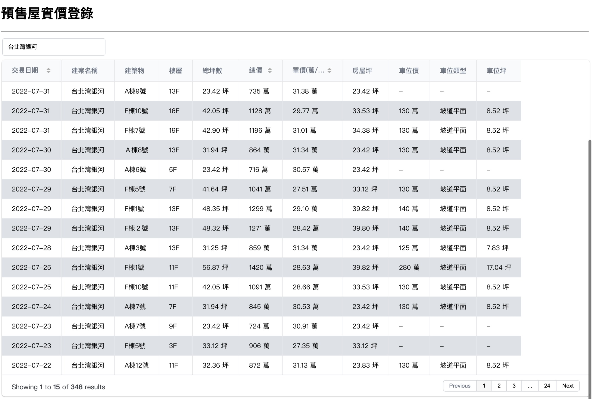

# pre-sale house

淡水區預售屋實價登錄列表</br>
簡化網頁瀏覽操作流程，以分頁表格呈現資料，簡化搜尋及排序。
</br>
[作品網站](https://www.electricbanana.info/)

## 描述

使用 `Flask` 框架開發 API 及 `Grid.js` 實作前端表格分頁、排序及搜尋框。

<p align="center">

</p>

## 如何使用
    
設置環境變數

    $ cp .env.example .env

建立並部署

    $ ./run.sh --target local
    
    預設映像檔名稱及版本: `local/psh:latest`。

## API

- [取得列表](https://github.com/HMS24/pshouse/blob/master/assets/api_spec/show_deals.md) : `GET` [/apiv1/deals](https://www.electricbanana.info/apiv1/deals)
- [取得一筆資料](https://github.com/HMS24/pshouse/blob/master/assets/api_spec/show_deals.md) : `GET` [/apiv1/deals/:id](https://www.electricbanana.info/apiv1/deals/2)
- [取得統計資料](https://github.com/HMS24/pshouse/blob/master/assets/api_spec/show_deal_statistics.md) : `GET` [/apiv1/deal-statistics](https://www.electricbanana.info/apiv1/deal-statistics)

## 程式碼架構

```shell
.
├── build
│   ├── app
│   │   ├── test.sh         # 啟動一個 container 跑測試
│   │   └── Dockerfile
│   ├── proxy
│   │   ├── conf            # nginx conf 無需用到
│   │   └── Dockerfile
│   ├── build.sh
│   └── push.sh
├── deploy               
│   ├── deploy.sh           
│   └── publish.sh          # 在遠端機器部署的 script
├── migrations
├── tests                   
├── requirements            
├── app
│   ├── api
│   │   ├── deals.py
│   │   ├── decorators.py
│   │   └── errors.py
│   ├── errors
│   │   └── handlers.py     # 處理 api error response 或 回傳 error html
│   ├── main
│   │   └── views.py
│   ├── static           
│   ├── template
│   ├── exceptions.py
│   ├── schemas.py          # serializing and args parse schema
│   ├── models.py
│   ├── stores.py
│   └── utils.py
├── .env                    
├── pshouse.py              # 程式入口
├── config.py
├── boot.sh                 # container entrypoint script
├── compose.yml
└── run.sh                  # 執行 build and deploy 的 script
```
